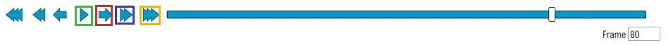

# CEE 320 Worker keypoint annotation tool - annotation walk through

Click [here](https://www.useloom.com/share/0adaba9e3af74cfaaee68b453431bd32) for a full keypoint annotation demo video. 

## 0. Log in to annotation website

 - User accounts will be set up by Tuesday (10/30) 11 PM, you will recieve our confirmation email, then you can start your assignment.
 - Use your preferred username and password, and log in to [annotation website](visualconstruction.cee.illinois.edu). Website requries school network to access. If you are off-campus, try connecting through VPN, [UIUC VPN setup instruction](https://techservices.illinois.edu/services/virtual-private-networking-vpn/download-and-set-up-the-vpn-client) is here.  

 ## 1. A walk-though to annotation interface

 ### 1.1 Annotation Panel

 1. Annotation Panel Overview. Below is an example annotation panel, each panel section and their functionalities will be introduced.
      

 2. **Function Panel**. A Button to create new worker instance. After pressing *Create Worker/Track* button, hover your mouse to Annotation Panel and place the default skeleton to proper area.  

    - use the correct skeleton **left-right** orientation. We use worker's left and right as the correct orientation. Before placing the skeleton, press "**Ctrl**" key and move your mouse to switch left and right. 

 3. **Annotation Area**. Main region to diaplay frames and annotated keypoints. Hover over the displayed image, press left mouse key and drag to move the image; use mouse middle wheel to scale the image.
    - flag occluded keypoints. Hover your mouse to a occluded keypoint and press ``s`` to set it as occluded, press again to cancel. If a keypoint is annotated as occluded, it will stay as occulded unless another keyframe says otherwise.

 4. **Worker Labels**. All created worker instances will show up here. For each worker, the **eye** icon is used to set visibility of keypoints for this worker at current frame; the **solid star** icon indicates at least one keypoints of this worker at current frame is annotated by human, such frame is called a **keyframe**. 

     

 5. **Progress Control Panel**.  This panel allows you to go through current video and setup some playback utilities.

    - Clicking on the progress bar allows you jump to frames, and buttons implement the following utilities.

    

    - button in green box: play/pause, red box: next frame, blue box: 10 frame forward, orange box: end frame. Buttons on the other side have same functions for backward playback.

    - hotkeys to progress bar buttons:
        - ``space`` : play/pause.
        - ``e``: previous keyframe; ``r``: next keyframe 
        - ``d``: previous frame; ``f``: next frame.
        - ``c``: jump to 10 frames before; ``v``: jump to 10 frames ahead.

    - to set playback speed and forward step size go to settings (``Open Menu`` —> ``Settings``), modify ``Player Speed`` to change playback speed, change ``Player Step`` property to change step size.

    

    

    - **Don't forget to save your work when finished.**

